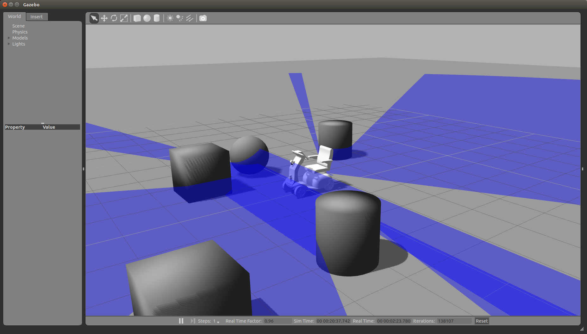
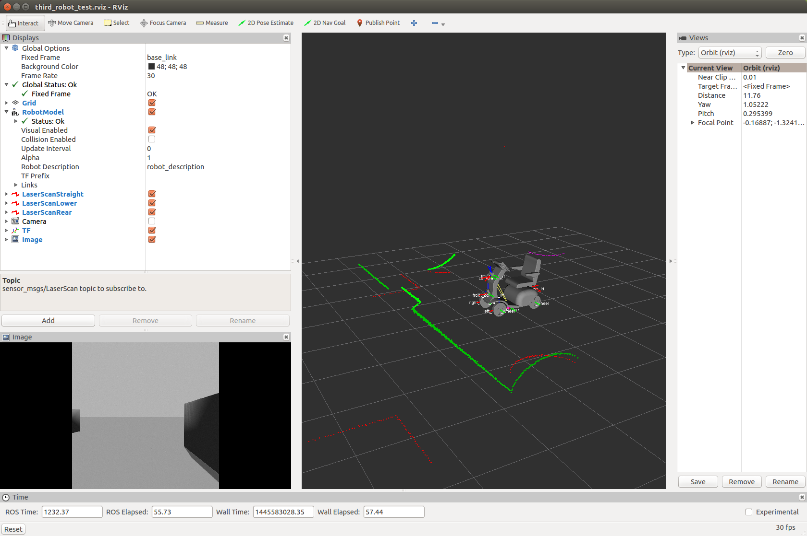

# cirkit_unit03_gazebo(CAUTION: DESCRIPTION HERE DEPRECATED!!!)
## Summary
- 3号機をGazeboに対応させました。
- [`Skid Steering Drive`](http://gazebosim.org/tutorials?tut=ros_gzplugins#SkidSteeringDrive)を採用しています。

## Main Subscribed Topic
- `cirkit_unit03/cmd_vel`
  - `Twist`型。速度指令値。teleopしてみて下さい。

## Main Published Topic
- `cirkit_unit03/laser/base_scan`
  - `LaserScan`型。前方スキャン。
- `cirkit_unit03/laser/base_scan1`
  - `LaserScan`型。前方下方スキャン。
- `cirkit_unit03/laser/base_scan2`
  - `LaserScan`型。後方スキャン。
- /cirkit_unit03/camera1
  - /camera_info
  - /image_raw
    - 画像です。

## How to launch
### gazebo
```
roslaunch cirkit_unit03_gazebo cirkit_unit03_world.launch 
```
 
### controller(robot state publisher)
```
roslaunch cirkit_unit03_gazebo cirkit_unit03_control.launch 
```

### rviz
```
roslaunch cirkit_unit03_gazebo cirkit_unit03_rviz_test.launch
```
 

