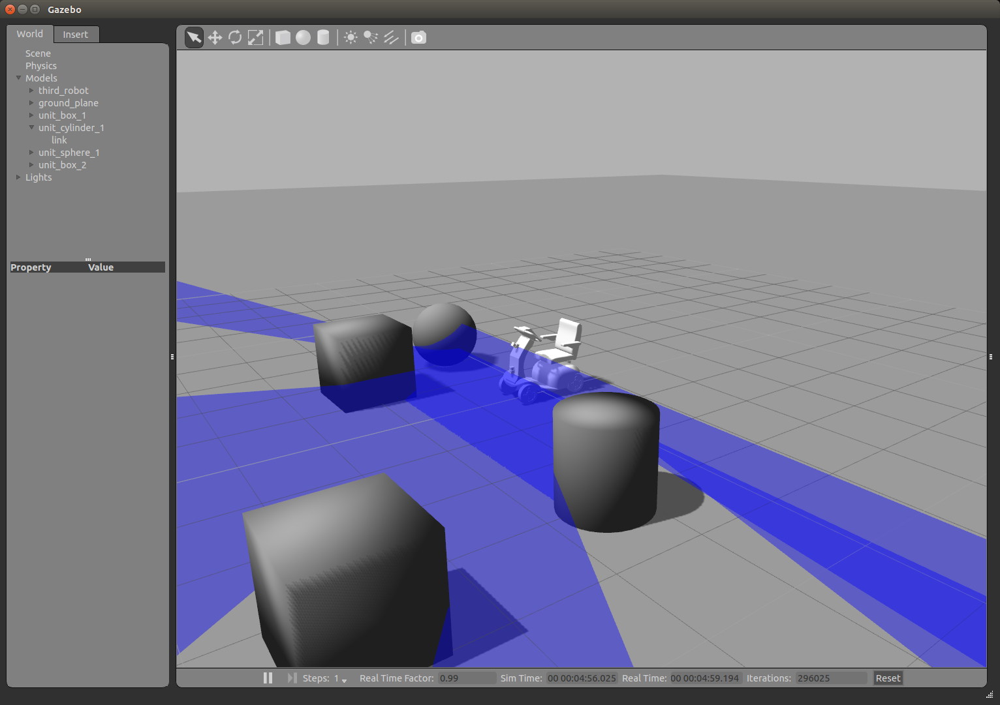
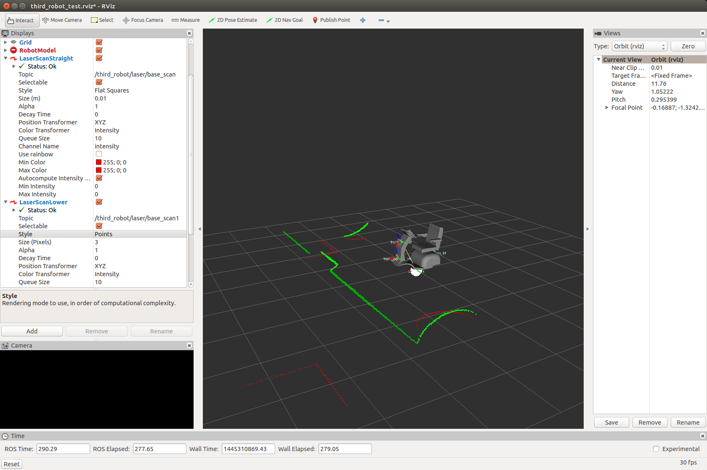

# third_robot_gazebo
## Summary
- 3号機をGazeboに対応させました。
- [`Skid Steering Drive`](http://gazebosim.org/tutorials?tut=ros_gzplugins#SkidSteeringDrive)を採用しています。

## Main Subscribed Topic
- `third_robot/cmd_vel`
  - `Twist`型。速度指令値。teleopしてみて下さい。

## Main Published Topic
- `third_robot/laser/base_scan`
  - `LaserScan`型。前方スキャン。
- `third_robot/laser/base_scan1`
  - `LaserScan`型。下方スキャン。
- 前方カメラもすぐやります。

## How to launch
### gazebo
```
roslaunch third_robot_gazebo third_robot_world.launch 
```
 
### controller(robot state publisher)
```
roslaunch third_robot_gazebo third_robot_control.launch 
```

### rviz
```
roslaunch third_robot_gazebo third_robot_rviz_test.launch
```
 


## 惜しいところ
- ホイールの`tf frame`が`rviz`に出てくれていません。
- でも、`teleop`は効いています。
- `controller`の設定の辺りがまだ曖昧かも。
